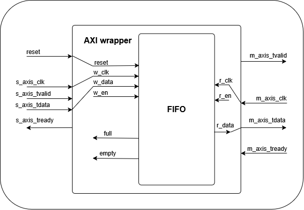
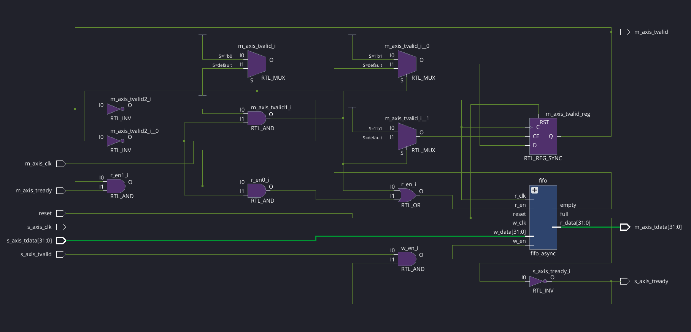
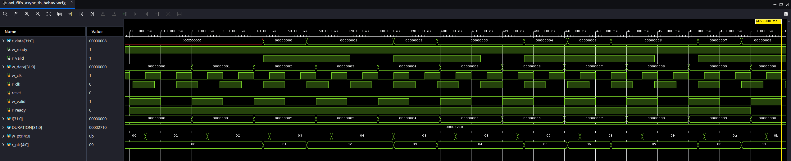
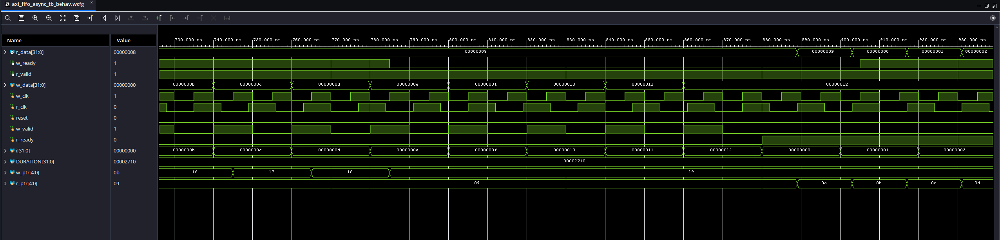
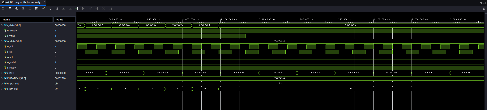

# Async-FIFO-AXI

This project implements an asynchronous FIFO with an outer AXI module.

  

Here is a list of the ports of the top level AXI wrapper module:
- `reset` : resets the FIFO
- `s_axis_clk` : Upstream clock signal (write)
- `s_axis_tvalid` :  Data on s_axis_tdata is valid if this signal is high
- `s_axis_tdata` :  Data to write
- `s_axis_tready` :  FIFO is ready to receive data if this signal is high
- `m_axis_clk` :  Downstream clock signal (read)
- `m_axis_tvalid` :  Data from FIFO is valid if this signal is high
- `m_axis_tdata` :  Data to read
- `m_axis_tready` :  Slave on downstream side is ready to receive data if this signal is high

Internal Signals of the top level AXI wrapper module:
- `w_en` :  Controls when FIFO is written to
- `r_en` :  Controls when FIFO is read from
- `full` :  Goes high when FIFO is full
- `empty` :  Goes high when FIFO is empty

Here is a list of the ports of the FIFO module:
- `reset` :  resets both pointers to zero and memory to empty
- `w_clk` :  Write clock signal
- `r_clk` :  Read clock signal
- `w_en` :  Enables write when signal is high
- `w_data` :  Data to be written to FIFO memory
- `r_en` :  Enables read when signal is high
- `r_data` :  Data to be read from FIFO memory
- `full` :  Goes high when FIFO memory is full (Gray code pointers indicate full distance from each other)
- `empty` :  Goes high when FIFO memory is empty (Gray code pointers are equal to each other)

Internal Signals of the FIFO module:
- `w_ptr` :  Write pointer
- `r_ptr` :  Read pointer
- `sync_w` :  First write pointer flip-flop to synchronize across Clock Domains
- `sync_prew` :  Second write pointer flip-flop to synchronize across Clock Domains
- `gray_w` :  Write pointer (Gray)
- `sync_r` :  First read pointer flip-flop to synchronize across Clock Domains
- `sync_prer` :  Second read pointer flip-flop to synchronize across Clock Domains
- `gray_r` :  Read pointer (Gray)
- `mem` :  Register to hold FIFO data

  

Here are the results of a few of the test benches in Vivado simulation:

  

The waveform above was the first test case where data was written to and read from.

 

  

The waveform above was the second test case where data was attempted to be written to a full FIFO.

 

  

The waveform above was the third test case where data was attempted to be read from an empty FIFO.

 

An overview of the challenges that were addressed and their solutions:
- **Clock Domain Crossing** 
  - Used two flip flop synchronizers to cross pointer signals between clock domains and prevent metastability
  - Used Gray-coded pointers to safely transfer FIFO state
- **Full/Empty detection** 
  - Used local and gray pointers to compare to empty + full conditions
- **AXI Integration** 
  - Created an AXI wrapper to interface with the standard handshaking protocol
- **Verification** 
  - Created test benches to verify FIFO operation under conditions of full, empty, reading, and writing
  

